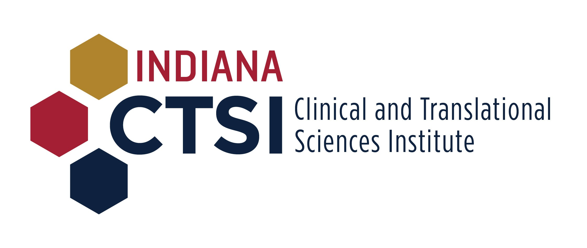



My interest in traumatic brain injury was sparked by a series of sports-related concussions I sustained as a teenager and young adult. After completing my undergraduate degree in neuroscience at Indiana University and working in [Dr. Andrea Hohmann's lab](https://www.hohmann-lab-indiana.com/) studying neuropathic pain and the endocannabinoid system, I was interested in using molecular neuroscience to study traumatic brain injury, which prompted me to seek predoctoral training with [Dr. Keisuke Kawata](https://publichealth.indiana.edu/research/faculty-directory/profile.html?user=kkawata&_gl=1*1iitz0k*_gcl_au*MjAxOTI0OTgwNi4xNzI0MTcwMTU2*_ga*NzgxNzUyLjE3MjI5ODE2ODk.*_ga_61CH0D2DQW*MTcyNDE3MDE1NS4yLjEuMTcyNDE3MDE2OS40Ni4wLjA.) in the School of Public Health. In Kei's lab, I studied the acute and sub-acute effects of exposure to subclinical concussive head impacts--impacts to the head that do not result in clinical concussion. We used blood biomarkers, oculomotor assessments, neurocognitive tests, and neuroimaging to study teh neurobiological and functional effects of these head impacts in [high school football players](https://education.indiana.edu/news/2019/jul-dec/2019-09-10-subconcussive-study.html?_gl=1*1ugqwjy*_gcl_au*MjAxOTI0OTgwNi4xNzI0MTcwMTU2*_ga*NzgxNzUyLjE3MjI5ODE2ODk.*_ga_61CH0D2DQW*MTcyNDE3NzAzNS4zLjAuMTcyNDE3NzAzNS42MC4wLjA.), young adult amateur soccer players, and collegiate women's water polo players.

I just started my third year as a postdoctoral fellow at Emory University, where I work with Dr. Jennifer Stevens and the [Grady Trauma Project (GTP)](https://www.gradytraumaproject.com/). GTP is a large, ongoing research study of the effects of stress and trauma-related risk and resiliency factors for post-traumatic stress disorder (PTSD). To date, GTP has recruited over 12,000 participants from Grady Memorial Hospital and the greater Atlanta area. GTP conducts both observational and intervention-based studies, including a transcraninal magnetic stimulation (TMS) treatment study for individuals with PTSD and a longitudinal study of changes in threat-related hyperarousal across perimenopause ([CHAPTERS](https://www.gradytraumaproject.com/chapters-study)). As a member of the CHAPTERS study team, I oversee the weekly menstrual cycle tracking and reproductive stage coding. My primary postdoctoral research project, funded by my postdoctoral NRSA (F32MH134528), focuses on sex differences in structural and functional connectivity in trauma survivors. This project uses data from the [AURORA/DISENTANGLE Study](https://www.med.unc.edu/itr/aurora-study/), a multi-site, longitudinal study of trauma survivors recruited from emergency departments. I'm specifically interested in sex-specific associations between connectivity and peripheral levels of glial fibrillary acidic protein (GFAP), a protein expressed by astrocytes and released following neurotrauma, and how this relates to symptom burden and health-related quality of life. 

Outside of work, I enjoy running, playing with my dogs, spending time with my family and friends, baking bread, and gardening.

##### FUNDING
My research and training have been supported by the following organizations:

**Indiana Clinical and Translational Sciences Institute**

**NIH/National Institute of Mental Health**

